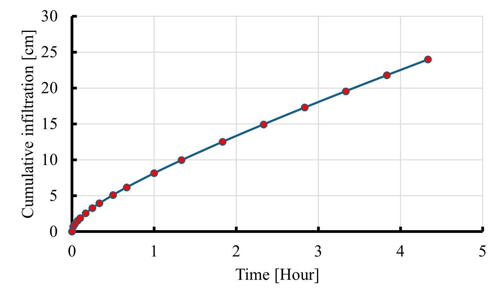

# Python and Matlab scripts employing characteristic time (CTM) method to estimate soil hydraulic properties from 1D infiltration data

Welcome to the repository for the characteristic time method (CTM). This repository contains the code of soil infiltration Characteristic Time Method (CTM) to predict Soil hydraulic properties estimation from 1D-dimensional infiltration experiments, along with example data, documentation, and instructions for usage.

## Overview

Accurate and reliable estimation of hydraulic properties of variably saturated soils from infiltration experiments is still a major challenge in many research fields such as hydrology, irrigation, civil engineering, and environmental science. Soil sorptivity (S) - a measurable physical quantity, that expresses the capacity of a porous medium to absorb or release liquids by capillarity, and saturated hydraulic conductivity ($K_s$), a measure of the soil’s ability to transmit water under the influence of gravity, are among the important hydraulic properties which are used to parametrize soil infiltration process in predictive models such as land surface models (LSMs). Infiltration is the process by which water enters the soil surface and it is one of the key fluxes in the hydrological cycle and the soil water balance. Water infiltration and the subsequent redistribution of water in the subsurface are two important processes that affect the soil water balance and influence several soil processes and functions including the availability of water and nutrients for plants, microbial activity, erosion rates, chemical weathering, and soil thermal and gas exchange between the soil and the atmosphere. 

The infiltration process is quantified by determining the amount of water that infiltrates over time (Figure 1), from which the cumulative infiltration, $I(t)$, [L], and the infiltration rate, $i(t)$, [$`LT^{-1}`$] can be derived. $i(t)$ and $I(t)$ are related to each other by derivation:

$i(t) = \frac{dI(t)}{dt}$

Figure 1: Example cumulative infiltration curve 

In the past decades, a large number of theoretical, semiempirical, and empirical models have appeared in the literature that quantitatively describe water infiltration into the soil. These models were used for the characterization of soil hydraulic properties, including S and $K_s$. According to their theoretical definitions, S is a measurable physical quantity, which expresses the capacity of a porous medium to take up and release liquids by capillarity, whereas Ks measures the soil's ability to transmit water under the influence of gravity.

## Repository Structure

- **README.md**: You are here! This file provides an overview of the repository.
- **Codes**: Contains all the code related to the research project.
- **Data**: Contains datasets used in the research project.
- **Documentation**: Contains additional documentation related to the research project.
- **License**: Specifies the terms of use for the code and data.
- **environment.yml**: Specifies the required dependencies for running the code.

## Usage

To install the required packages, import the environment provided through the file 'environment.yml' using the following command: conda env create -f environment.yml.

## License

MIT License

## References

Rahmati, Mehdi, Jan Vanderborght, Jirka Šimůnek, Jasper A. Vrugt, David Moret‐Fernández, Borja Latorre, Laurent Lassabatere, and Harry Vereecken. "Soil hydraulic properties estimation from one‐dimensional infiltration experiments using characteristic time concept." Vadose Zone Journal 19, no. 1 (2020): e20068.  https://doi.org/10.1002/vzj2.20068. 

## Contact

Mehdi Rahmati
Email: mehdirmti@gmail.com
Alternative email: m.rahmati@fz-juelich.de

